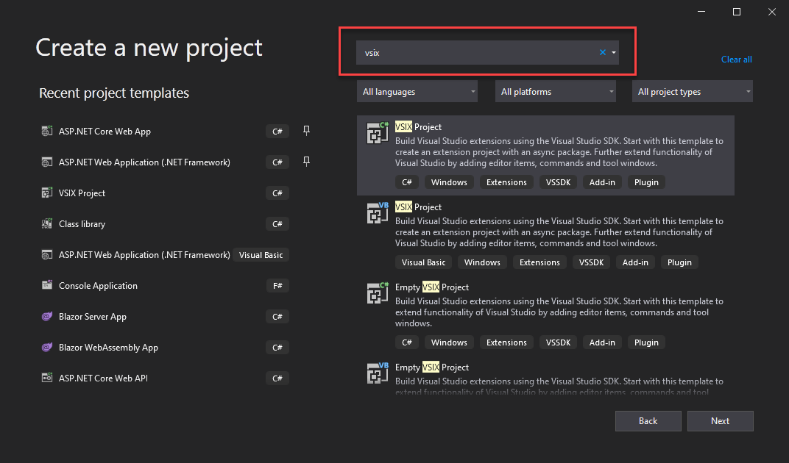
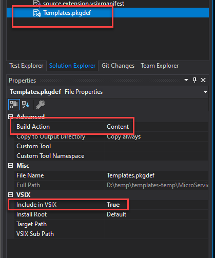
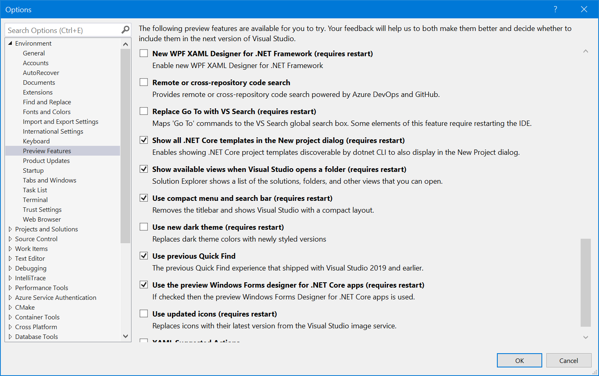
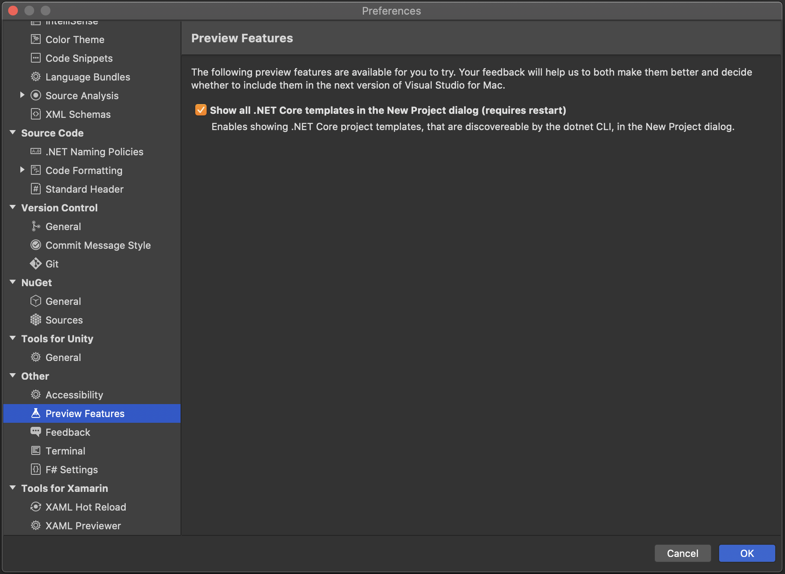
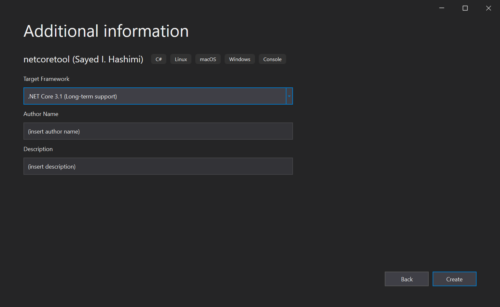

# Info on how to create templates that work in dotnet new and Visual Studio/Visual Studio for Mac

This repo contains a couple samples showing how you can create a .net core template that can be used either by the
dotnet command line (`dotnet new`) or Visual Studio & Visual Studio for Mac. For more info see [.NET CLI Templates in Visual Studio
](https://devblogs.microsoft.com/dotnet/net-cli-templates-in-visual-studio/).

The samples are in the `src/content` folder.

Add an issue here, or reach out to [@SayedIHashimi](https://twitter.com/sayedihashimi) on twitter with any questions.

To discover templates that have already been created go to https://dotnetnew.azurewebsites.net/.

The main content here assumes that you are working with Visual Studio 2022 and .net 6. Visual Studio 2022/.net 6 has some updates to the community template experience
that Visual Studio 2019 doesn't have. At the bottom there is a section that describes the 
[additional work that is needed to fully support VS2019](#supporting-visual-studio-2019).

## Finding and installing templates

In .net 6 there has been improvements to `dotnet new --search` to find templates that are published on `nuget.org`.

You can use the integrated help to learn more about how to use the search command. You can get the command specific help by executing
`dotnet new --search -h`.

To search for a template by name the syntax you'll use is `dotnet new <TEMPLATE_NAME> --search`. For example, if you are looking for the .NET Boxed templates,
you can execute `dotnet new boxed --search`. When I executed this command the results I received are below.

```bash
> dotnet new boxed --search
Searching for the templates...
Matches from template source: NuGet.org
These templates matched your input: 'boxed'

Template Name                                  Short Name  Author        Language  Package                       Downloads
---------------------------------------------  ----------  ------------  --------  ----------------------------  ---------
ASP.NET Core API Boxed                         api         .NET Boxed    [C#]      Boxed.Templates                     39k
ASP.NET Core GraphQL Boxed                     graphql     .NET Boxed    [C#]      Boxed.Templates                     39k
ASP.NET Core Orleans Boxed                     orleans     .NET Boxed    [C#]      Boxed.Templates                     39k
Boxed templates: Sophon.Boxed.BasicConsoleApp  bca         ZhaoBingwang  [C#]      Sophon.Boxed.BasicConsoleApp         2k
Boxed templates: Sophon.Boxed.BasicWebApi      bwa         ZhaoBingwang  [C#]      Sophon.Boxed.BasicWebApi             1k
NuGet Package Boxed                            nuget       .NET Boxed    [C#]      Boxed.Templates                     39k


To use the template, run the following command to install the package:
   dotnet new --install <PACKAGE_ID>
Example:
   dotnet new --install Boxed.Templates
```

Since we are interested in the .NET Boxed templates, the install command would be `dotnet new --install Boxed.Templates`. After installing these templates
you can use those templates from the CLI using `dotnet new` or Visual Studio.

## How to uninstall templates

The command to use to uninstall templates is `dotnet new --uninstall`. If you simply execute `dotnet new --uninstall` it will display a list of template packs
that have been installed, as well as a command for every template pack that you can use to uninstall that template pack. On my machine I have the .NET Boxed template pack
installed. When I execute `dotnet new --uninstall` the result is shown below.

```bash
> dotnet new --uninstall
Currently installed items:
   Boxed.Templates
      Version: 6.10.0
      Details:
         Author: Muhammad Rehan Saeed (RehanSaeed.com)
         NuGetSource: https://api.nuget.org/v3/index.json
      Templates:
         ASP.NET Core API Boxed (api) C#
         .editorconfig file (editorconfig) C#
         .gitattributes file (gitattributes) C#
         ASP.NET Core GraphQL Boxed (graphql) C#
         NuGet Package Boxed (nuget) C#
         ASP.NET Core Orleans Boxed (orleans) C#
      Uninstall Command:
         dotnet new --uninstall Boxed.Templates
```

The command to unstall this template pack is shown on the last line `dotnet new --uninstall Boxed.Templates`. After uninstalling the template, you will no longer
be able to access that via `dotnet new` or Visual Studio. If you are using Visual Studio 2019, it's recommended that you restart Visual Studio after uninstalling templates.

## Getting started creating templates

To get started creating templates, take a look at the following resources.
 - [How to create your own templates for dotnet new
](https://devblogs.microsoft.com/dotnet/how-to-create-your-own-templates-for-dotnet-new/)
 - [Custom templates for dotnet new
](https://docs.microsoft.com/en-us/dotnet/core/tools/custom-templates)
 - [Sources for asp.net core templates](https://github.com/dotnet/aspnetcore/tree/master/src/ProjectTemplates)
 
## Template analyzer

Sayed is working in his free time to create a tool that can be used to analyze .NET Core templates. You can install the analyzer with the command.

```bash
> dotnet tool install --global sayedha.template.command
```

For usage info run `templates -h`.

After installing the tool you can invoke it by running `templates` in the command line. You can analyze templates that are stored in a local folder
with the `-f` parameter. You can also analyze templates that are contained in a NuGet package (.nupkg) file with the `-p` switch.

For example to analyze a folder you would run.

```bash
> templates analyze -f <path-to-folder>
```

When you pass in a path, the tool will search the sub-folders to discover templates. If you are building several templates, you can pass
in a parent folder that contains all the templates, and each template that is discovered will be analyzed.

### What the tool looks for

Error if missing a required property
-	`$.author`,
-	`$.sourceName`,
-	`$.classifications`,
-	`$.identity`,
-	`$.name`,
-	`$.shortName`,
-	`$.tags`,
-	`$.tags.language`,
-	`$.tags.type`
 
Warnings for missing recommended properties
-	`$.defaultName`,
-	`$.description`,
-	`$.symbols`,
-	`$.symbols.Framework`,
-	`$.symbols.Framework.choices`
 
Error if `$.tags.type` is not set to either project or item
Warning if `$.symbols.Framework.type` is not set to parameter.
Warning if `$.symbols.Framework.datatype` is not set to choice.

## Some important things needed to create good templates

### Use the schema for completions and validation

You should add the `$schema` property to your `template.json` file. Both Visual Studio and Visual Studio Code
will provide completions and validation based on the schema. Other editors have similar support as well.

```json
{
"$schema": "http://json.schemastore.org/template",
}
```

### `sourceName`

In the `template.json` file you should have a `sourceName` property declared. The `sourceName` property is special, and should always be declared. When a project is created, either through the command line or Visual Studio, the project will be given a name. For example, when creating a project with `dotnet new` you can pass in the `-n|--name` parameter. In Visual Studio during New Project the user will be prompted to provide a project name.
The value provided by the user for project name will replace the string declared in `sourceName`. This is typically
used to replace the `namespace` declaration in generated files.

```json
{
  "sourceName": "MyCommand",
}
```

For a full example of `sourceName` see [src/Content/MyCommand/.template.config/template.json](template.json)

### `defaultName`

When a project is created in Visual Studio, the screen that the user provides the project name will always be
pre-populated. If `defaultName` is declared in the `template.json`, that value will be used as the default name
for the project. Otherwise `Project1` is always used.
When users create projects from the command line with `dotnet new` if the `-n|--name` parameter is not passed in, the `defaultName` value will be used.

```json
{
  "defaultName": "MyCommandTool",
}
```

For a full example of `sourceName` see [src/Content/MyCommand/.template.config/template.json](template.json)

### `classifications`

In Visual Studio when creating a new project there is an `All Project Types` dropdown that can be used to filter
the list of templates shown. You should declare the relevant values from that dropdown in the `classifications`
property of the `template.json`. Here are some of the values that you can use.

 - Cloud
 - Console
 - Desktop
 - Games
 - IoT
 - Library
 - Mobile
 - Service
 - Web

Here is an example of the declaration.

```json
{
  "classifications": ["Console"],
}
```

Note: in the current preview the Visual Studio New Project Dialog will add all classifications from installed 
templates into the `All Project Types` dropdown. That behavior is likely to change, custom classifications
will not be listed. You should select the values that you see in Visual Studio (without any additional tempaltes installed) so that the user can filter.

### Language and type

In the `template.json` you should define the `language` and `type` for the template in the `tags` property. For
example

```json
"tags": {
  "language": "C#",
  "type":"project"
},
```

***If the `type` property is not declared, the template will not be shown in the Visual Studio New Project Dialog***

### Framework

In the `template.json` file you should indicate what target framework, or frameworks, the template supports.
To do that you'll update the `symbols` section to include a `Framework` property. Below is an example of what
should be included for a template that targets .NET Core 3.1.

```json
"symbols": {
  "Framework": {
    "type": "parameter",
    "description": "The target framework for the project.",
    "datatype": "choice",
    "choices": [
    {
        "choice": "netcoreapp3.1",
        "description": "Target netcoreapp3.1"
    }
    ],
    "replaces": "netcoreapp3.1",
    "defaultValue": "netcoreapp3.1"
  }
}
```

If your template supports multiple frameworks, add additional values to the `choices` array.

*Note: due to a bug, if your template contains parameters that you want to appear in Visual Studio, you'll need to specify the framework symbol.*

### Generating ports for web projects

If your template consists of a web project, it's likely that you'll want to generate new port numbers to be used
when the template is used. This is a bit complex to do correctly, but we will explain the different parts.
When defining the support, for each different port number we want the following to create a command line parameter
that can be used to explicitly set the port number. If the port number is not passed in by the user, then we want
to generate a port number automatically.

To achieve this, we will need to create three new symbols in the `template.json` file. We will create the following
symbols.

 - Parameter that the user can pass in
 - A generated port number
 - Symbol to coalesce the user parameter and the generated port

Here is a sample, where we specify the range that we want the port number to be in.

```json
"HttpsPort": {
  "type": "parameter",
  "datatype": "integer",
  "description": "Port number to use for the HTTPS endpoint in launchSettings.json."
},
"HttpsPortGenerated": {
  "type": "generated",
  "generator": "port",
  "parameters": {
  "low": 44300,
  "high": 44399
  }
},
"HttpsPortReplacer": {
  "type": "generated",
  "generator": "coalesce",
  "parameters": {
  "sourceVariableName": "HttpsPort",
  "fallbackVariableName": "HttpsPortGenerated"
  },
  "replaces": "44345"
}
```

`HttpsPort` is the user facing parameter that can be passed in when calling `dotnet new`.

`HttpsPortGenerated` is the generated port number. In this example we specified a `low` and a `high` value. The
generated port number will be between those. These parameters are optional.

`HttpsPortReplacer` is the symbol that will decide between `HttpsPort` and `HttpsPortGenerated`. If a value is provided via the command line (`HttpsPort`) it will be given preference. Take note of `44345` in this symbol. This
is the port number that the source files use. Where ever this string is found in the template content, it will
be replaced with the new port number.

For a full example of `sourceName` see [src/Content/MyWebApp/.template.config/template.json](template.json)

## How to test template changes locally

In Visual Studio 2022 you can install templates either via a NuGet package (.nupkg file) or via the folder based path (`dotnet new --install [local-file-path]`).

In order for a template to appear in Visual Studio 2019 it needs to be installed using a NuGet package
(.nupkg file). When developing templates locally, when you are ready to test your template using
Visual Studio, follow the steps below.

It's recommended that you delete the cache folders that are used for the templates. The chache folders are in the user home directory (`~`) under the `.templateengine` folder. The default path on windows is `C:\Users\{username}\.templateengine` and for macOS `/Users/{username}/.templateengine`.

 1. Close all instances of Visual Studio
 1. Create a NuGet package that has the template
 1. Delete Template Engine cache folders (folders under `~/.templateengine`)
 1. Install the template using `dotnet new --install <path-to-nuget-package>`
 1. Start Visual Studio

Here is a PowerShell function that you can add to your profile to make this simpler

```ps
function Reset-Templates{
    [cmdletbinding()]
    param(
        [string]$templateEngineUserDir = (join-path -Path $env:USERPROFILE -ChildPath .templateengine)
    )
    process{
        'resetting dotnet new templates. folder: "{0}"' -f $templateEngineUserDir | Write-host
        get-childitem -path $templateEngineUserDir -directory | Select-Object -ExpandProperty FullName | remove-item -recurse -force
        &dotnet new --debug:reinit
    }
}
```

## Common issues

If your template is not appearing in Visual Studio, check the following.

### Required properties

Ensure that the following required properties are set in the `template.json` file.

- `author`
- `sourceName`
- `classifications`
- `identity`
- `name`
- `shortName`
- `tags`

For tags ensure you have specified the `language` and `type` values. See the example below.

```json
  "tags": {
    "language": "C#",
    "type": "project"
  },
```

The `type` value can be either `project` or `item`, other values should not be used.

### `primaryOutputs`

If you have a single project template, you typically don't have to specify the `primaryOutputs` property.
If your `templates.json` file has specified `primaryOutputs`, Visual Studio will open load the project(s)
specified. If the value for `primaryOutputs` is not correct, the project(s) will not load in Visual Studio.

If the value for the `primaryOutputs` is not correct, the project(s) will not be loaded in Visual Studio

### Verify that the NuGet package has the correct files

After creating the .nupkg file you can examine it by extracting the contents using your favorite zip tool.
The .nupkg file is just a .zip file with a different file extension.
Double check that the `.template.config` folder is in the package as well as the `template.json` file
and any host files.

### How to prevent showing a template in Visual Studio

If you have a template, and do not want that template to appear in Visual Studio when it's been installed using `dotnet new --install`
add the `unsupportedHosts` property. For example, see the `ide.host.json` file below.

```json
{
  "$schema": "http://json.schemastore.org/vs-2017.3.host",
  "icon": "icon.png",
  "symbolInfo": [
    {
      "id": "AuthorName",
      "name": {
        "text": "Author Name"
      },
      "isVisible": "true"
    },
    {
      "id": "Description",
      "name": {
        "text": "Description"
      },
      "isVisible": "true"
    }
  ],
  "unsupportedHosts": [
    { 
      "id": "vs"
    } 
  ]
}
```

The host identifier of `"vs"` refers to Visual Studio 2019. To exclude from any other host, use the host identifier associated with that product.

## How to create a multi-project (Solution) template
Creating a multi-project (solution) template, is very similar to creating a single project template. You'll need to make the following changes to properly
create a solution template.

 1. Make sure that the `.template.config` folder is in the correct folder. It likely should be in the root of the solution. The `.sln` file should be either in the
 same directory as `.template.config` or under it. Same goes for all the content (i.e. projects) that the template should contain.
 1. In the `template.json` file change the `type` tag to be `solution` instead of `project`.
 1. Update `template.json` to create unique GUIDs to replace the Project ID in the `.sln` file.

For the last step, we will need to update the `template.json` file. You can use the `guids` property to help. Below is a sample

The Project ID values can be found in the `.sln` file. For example here is a snippet from the SolutionTemplate sample in this repo.

```
MinimumVisualStudioVersion = 10.0.40219.1
Project("{2150E333-8FDC-42A3-9474-1A3956D46DE8}") = "Libraries", "Libraries", "{3C7060D1-D7AF-4B5D-BF1F-BC0E4F39E7ED}"
EndProject
Project("{2150E333-8FDC-42A3-9474-1A3956D46DE8}") = "Apps", "Apps", "{526E49A6-E41B-4136-8662-FC7BF000776A}"
EndProject
Project("{FAE04EC0-301F-11D3-BF4B-00C04F79EFBC}") = "SayedHa.Web.MyWeb", "SayedHa.Web.MyWeb\SayedHa.Web.MyWeb.csproj", "{0E62310C-D76A-4681-9926-B1BFFDC379FC}"
EndProject
Project("{FAE04EC0-301F-11D3-BF4B-00C04F79EFBC}") = "SayedHa.Web.MyClassLibrary", "SayedHa.Web.MyClassLibrary\SayedHa.Web.MyClassLibrary.csproj", "{032123E7-E4E0-4B17-9564-ECA4B57F30B7}"
EndProject
Global
```

The Project ID is the last Guid listed in the `Project` node. Below is a sample showing how to get those guids to be updated. Full sample is at [template.json](src/Content/SolutionTemplate/.template.config)

```json
...
  "preferNameDirectory": true,
  "guids": [
    "FAE04EC0-301F-11D3-BF4B-00C04F79EFBC",
    "12aa8f4e-a4aa-4ac1-927c-94cb99485ef1"
  ],
  "symbols": {
...
```

 Note in the initial preview of Visual Studio where this support appeared, we had a bug that required the `.sln` file to be listed in `primaryOutputs`.

## How to ship a template inside of a Visual Studio Extension (vsix)

If you are developing a [Visual Studio extension](https://docs.microsoft.com/visualstudio/extensibility/starting-to-develop-visual-studio-extensions?view=vs-2019) (.vsix file extension), you can deliver your templates inside of the vsix instead of relying on the end-user installing templates via `dotnet new --install`. This section will walk you through how to create a vsix that contains templates.

In order to create Visual Studio extensions you'll need to install the [Visual Studio SDK](Install the Visual Studio SDK). Let's create a new Visual Studio extension, and add a template into it.

### Create the Visual Studio Extension project

First we will need to create a new Visual Studio Extension project. If you have an existing project that you are using, you can open your existing project instead of creating a new project. To create the new project, use the New Project dialog in Visual Studio. When you get to open the New Project dialog, you can search for
"vsix" in the search box on the top right. See the image below.



From the list below you can select VSIX Project, with either language that you prefer. The language of the extension
doesn't have to be the same language as the template itself. Now that the project is created, we need to make a few
modifications to support the project templates.

Before starting to add your template into the Visual Studio extension, you should ensure that your template works without issues from the command line.
You'll also want to ensure you've added the additional info to templates that is 
needed to support Visual Studio. That information was presented previously in this doc.

To add support for templates in a VSIX project, the following additions need to be made.

 1. Add the .nupkg file with your template(s) into the project
 1. Update the VSIX project file to include a new target
 1. Add a pkgdef file to indicate where to look for templates
 1. Update the .vsixmanifest file to have a new asset tag for the template

### Adding the .nupkg to your extension

Now you need to add the NuGet package (.nupkg file) to the extension. You'll need to copy the .nupkg file into a folder near the source for the extension. In the in the `vsix-with-template` folder
the file is placed in the `assets` folder. Now we need to modify the vsix project to pickup, and include, the .nupkg file so that it is included in the final vsix file that is built.
Add the following target in the vsix project file (.csproj or .vbproj) file.

```xml
<Target Name="PreCreateVsixContainer" BeforeTargets="GetVsixSourceItems">
  <ItemGroup>
    <!-- ensure that the path below is correct -->
    <_TemplatePackage Include="..\assets\*.nupkg" />
  </ItemGroup>
  <Error Text="No template files found." Condition="@(_TemplatePackage-&gt;Count()) == 0" />
  <Message Text="Template nuget packages found: @(_TemplatePackage)" Importance="low" />
  <!-- don't modify the following, the pkgdef file uses the path below -->
  <ItemGroup>
    <VSIXSourceItem Include="@(_TemplatePackage)">
      <VSIXSubPath>ProjectTemplates\</VSIXSubPath>
    </VSIXSourceItem>
  </ItemGroup>
</Target>
```

The `PreCreateVsixContainer` target will be called during the build process. It will look for .nupkg files in the assets folder and then include them in the vsix that
is produced from the build. You may need to customize the path to where the target looks for these .nupkg files. You can verify that the package was included successfully
by opening, or extracting, the .vsix file with your favorite zip utility. The package should be in the `ProjectTemplates` in the vsix.
Now that you've added the NuGet package, and updated the build process to include it, we can move on to the next step.

### Adding a pkgdef file

Now that the package is in the vsix, we need to add a pkgdef file so that the extension will register the templates during installation. Add a new file named `Templates.pkgdef` to your
vsix project. If you are using Visual Studio, you can use the text file item template in the New Item dialog. It's important that the name of this .pkgdef file is different from the
name of the vsix project. If your vsix project is named `Templates`, then you'll need to change the name of the new .pkgdef file you just added. The content of this new .pkgdef
should be similar to the following.

```
[$RootKey$\TemplateEngine\Templates\sayedha.template.netcoretool.nuspec\1.0.0]
"InstalledPath"="$PackageFolder$\ProjectTemplates"
```

Here the only values that you want to modify are `sayedha.template.netcoretool.nuspec\1.0.0`. You should use a path that is likely to be unique to your organization and project.
It doesn't have to match the project or templates that you are including. You can customize the version number in the path as needed as well. The second line in the pkgdef file,
indicates where the .nupkg files are located relative to the vsix install folder. You shouldn't modify the second line.

You should also mark the Templates.pkgdef file as Content and IncludeInVsix in the properties grid. See the image below.



### Update the .vsixmanifest

Now we are on the last step. The .vsixmanifest file needs to be updated to pickup the new pkgdef file you just created. Open the `source.extension.vsixmanifest` file and add the
asset tag below into the `Assets` element.

```
<Asset Type="Microsoft.VisualStudio.VsPackage" d:Source="File" Path="Templates.pkgdef" /> 
```

Adding the asset tag causes Visual Studio to process the new pkgdef file when the extension is installed.

That's it. Now you can build the VSIX project, install the extension and you should see your new template. The next step is to distribute your new extension. You can do that
by sharing the .vsix file directly, or publishing to the [Visual Studio Marketplace](https://marketplace.visualstudio.com/)

## Supporting Visual Studio 2019

We made some additional changes in Visual Studio 2022/.net 6, which Visual Studio 2019/.net 5 doesn't have. If you have a template(s) that need to support Visual Studio 2019/.net 5, you may need to make some additional changes to get the templates to work in Visual Studio 2019. Below is a summary of the additional work that is needed.

Limitations of Visual Studio 2019 and/or .net 5 regarding community templates.

 - Search functionality in `dotnet new` is not as robust as in .net 6.
 - VS2019 will need to have the icon and parameter info listed in the `ide.host.json` file. Parameters are not automatically shown in Visual Studio.
 - VS2019 requires a VS restart to get newly installed templates to appear in the IDE
 - In VS2019 showing CLI templates is disabled by default, see below on how to enable showing those.
 - In VS2019, displaying templates that have been installed with a folder path isn't supported. All templates need to be installed via a NuGet package (.nupkg file).

***TODO: more content will be added soon***

## How to enable cli templates in Visual Studio and Visual Studio for Mac

The feature to show templates that are installed using the command-line interface (cli) is a preview feature. This feature is disabled by default.

To enable this feature in ***Visual Studio***:

First open the Options dialog, go to `Tools > Options`. In the dialog go to `Environment > Preview Features` and then on the right-hand side and select the
preview feature named *Show all .NET Core templates in the New project dialog*. For more info see [.NET CLI Templates in Visual Studio
](https://devblogs.microsoft.com/dotnet/net-cli-templates-in-visual-studio/).



To enable this feature inn ***Visual Studio for Mac***:



First open the Preferences dialog, go to `Visual Studio (menu) > Preferences...`. In the list on the
left hand side, select `Other > Preview Features` and select the
preview feature named *Show all .NET Core templates in the New project dialog*.

## Visual Studio support

Starting in previews of 16.8 of Visual Studio we have a feature that can be enabled to show the templates
which have been installed with `dotnet new`. For more info on that take a look at the blog post [.NET CLI Templates in Visual Studio
](https://devblogs.microsoft.com/dotnet/net-cli-templates-in-visual-studio/).

There are some things that you'll want to make sure you have defined to ensure a good experience for
Visual Studio users.

### Add an `ide.host.json` file

Note: in Visual Studio 2022+ the `ide.host.json` file is no longer required for the template to appear in Visual Studio.
If there is an icon named `icon.png` in the `.template.config` folder, it will be used for the project template icon in Visual Studio.
By default all template parameters will appear in the New Project Dialog in Visual Studio.

In order to get the best support in Visual Studio, you'll want to add an `ide.host.json` file. This file should 
be in the `.template.config` folder next to the `template.json` file. You'll need to create this file in order to
show an icon for the template, to display parameters, to customize the text, and other features.

The schema that you should use when creating this file is shown below.

```json
{
  "$schema": "http://json.schemastore.org/vs-2017.3.host"
}
```

### How to add an icon to be shown in Visual Studio

Note: In Visual Studio 2022, you don't need to create an `ide.host.json` file to include an icon for the project template.
If there is an icon file named `icon.png` in the `.template.config` file, it will be picked up automatically. If you'd like to customize
that, then create an `ide.host.json` file as described below.

To add an icon, you will need to declare that in the `ide.host.json` file. The icon file should be a `.png` file.
The icon file should be in, or under, the `.template.config` folder. In the `ide.host.json` file declare the icon property as shown.

```json
{
  "icon": "icon.png"
}
```

If the icon file is in a sub-folder, provide a relative path in the `icon` declaration.

In the image below the icon for the sample console template is shown.


### How to make a parameter visible in Visual Studio

Note: in Visual Studio 2022+, by default all template parameters will appear in the New Project Dialog. You do not need to create
and `ide.host.json` file if you want all the parameters to be shown. You can create an `ide.host.json` if you need to hide some parameters.

In `template.json` you can declare any number of parameters. Those parameters will not by default show up in
Visual Studio. You need to specify which ones should show up in Visual Studio with an `ide.host.json` file.
The `MyCommand` sample template in this repo has three parameters defined.

 - Framework
 - AuthorName
 - Description

The `Framework` parameter defines the set of choices of target framework that the template supports. This parameter
should always be defined for .NET Core templates. This parameter is special, and doesn't need to be declared in the
`ide.host.json` file to be shown in Visual Studio. If this parameter is defined, the Target Framework dropdown in the New Project Dialog will automatically be shown.

In order to show the other two parameters, you will need to add a file named `ide.host.json` to the 
`.template.config` folder. Below is a sample file that shows how to make those appear in Visual Studio.

```json
{
  "$schema": "http://json.schemastore.org/vs-2017.3.host",
  "icon": "icon.png",
  "symbolInfo": [
    {
      "id": "AuthorName",
      "name": {
        "text": "Author Name"
      },
      "isVisible": "true"
    },
    {
      "id": "Description",
      "name": {
        "text": "Description"
      },
      "isVisible": "true"
    }
  ]
}
```

After adding this declaration, when the template is used in Visual Studio the parameters
will be presented to the user as

